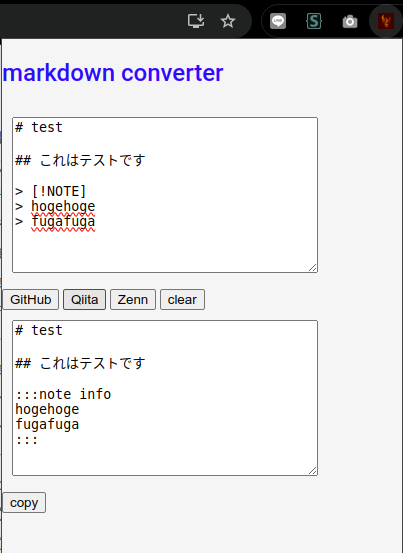

# md_converter_extensions


## INDEX

- [ABOUT](#about)
- [LICENSE](#license)
- [ENVIRONMENT](#environment)
- [PREPARING](#preparing)
- [HOW TO USE](#how-to-use)

---

## ABOUT

Browser Extensions to convert markdown note notation from GitHub, Qiita, and Zenn.

```
# GitHub

> [!NOTE]
> this is note
> hi
```

```
# Qiita

:::note info
this is note
hi
:::
```

```
# Zenn

:::message
this is note
hi
:::
```

---

## ENVIRONMENT

- Google Chrome
- Firefox

---

## HOW TO USE



1. copy your markdown article
2. push the extension icon
3. select the markdown notation
4. push `copy` button to copy the converted markdown

---

## PREPARING

### Google Chrome

- Go to [chrome://extensions/](chrome://extensions/) in Google Chrome and enable `Developer mode`.
- Click `Load unpacked` and select the directory where the extension is located.

### Firefox

- Go to [about:debugging#/runtime/this-firefox](about:debugging#/runtime/this-firefox) in Firefox.
- Click `Load temporary Add-on` and select `manifest.json`
---

## References

- [Google Chrome Extensions](https://developer.chrome.com/docs/extensions/)
